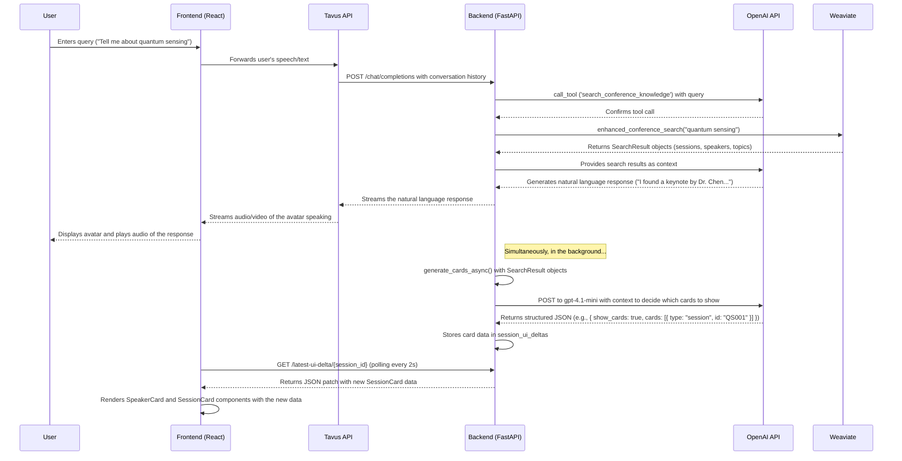

# CTBTO Avatar Project: Comprehensive Technical Documentation

## 1. Overview

This document provides a detailed, atomic-level technical overview of the CTBTO Avatar Project. The project is a **voice-only, non-interactive kiosk** designed to serve as an intelligent and diplomatic host for the CTBTO Science and Technology (SnT) 2025 conference. It is fundamentally a conversational AI system where the graphical user interface acts as a passive, read-only visual aid to the voice interaction, not as a traditional, interactive web application.

The system's architecture is built on a set of core principles that prioritize accessibility, performance on low-spec kiosk hardware, and a strict separation of concerns between the AI-driven backend and the presentation-focused frontend.

### 1.1. Core Architectural Principles

-   **Voice-Only Interaction:** The primary user interface is voice. All user input is handled via Speech-to-Text (STT) and all system responses are delivered via Text-to-Speech (TTS), managed by the Tavus CVI platform in its audio-only pipeline configuration. There are **no clickable, hoverable, or scrollable elements** in the UI. All cards are static, visual representations of information.

-   **Delta-Driven UI:** The frontend does not manage complex state or logic. Instead, it renders UI based on a stream of atomic state changes (**deltas**) emitted by the backend. Following the principles of AI-Generated UI (AG-UI), the backend sends JSON-patch style operations (e.g., `add`, `replace`, `remove`) that the frontend applies to its state. The UI is a direct function of the AI's state.

-   **Strict Handler/Card Separation:** A single, centralized data handler (`UIDeltaHandler`) is responsible for polling the backend for new deltas. This handler updates a global, atomic state store (Jotai). The React components (Cards) are "dumb" presenters; they simply read from the state store and render the data they are given. They do not fetch data or contain any interaction logic.

-   **AI-Orchestrated Rendering:** The backend AI has sole authority over what is displayed on screen. It uses a Restrictive UI Generation (RUG) pattern, selecting from a pre-defined whitelist of read-only card components and populating them with data retrieved from the Weaviate RAG system.

-   **Accessibility & Performance:** The system is designed to meet WCAG AAA standards, with high-contrast visuals, large font sizes (18px minimum), and appropriate ARIA roles for screen readers. Animations are used sparingly, and the entire system is optimized for performance on embedded kiosk hardware.

### 1.2. Technology Stack

#### Frontend
-   **Framework:** React 19 with Vite
-   **Language:** TypeScript (Strict Mode)
-   **UI Primitives:** Radix UI (Headless) & Tailwind CSS (Utility-First)
-   **State Management:** Jotai (Atomic)
-   **Data Fetching:** Tanstack Query (for efficient 2-second polling)
-   **Animation:** Framer Motion (for entrance/exit transitions only)
-   **Avatar/Voice Platform:** Tavus CVI (in audio-only mode)

#### Backend
-   **Framework:** FastAPI
-   **Language:** Python
-   **AI/LLM:** OpenAI GPT-4.1
-   **Vector Database:** Weaviate (v4 Compliant)
-   **Dependencies:** `uvicorn`, `pydantic`

## 2. System Architecture (End-to-End Flow)

The following diagram illustrates the complete lifecycle of a user interaction in the voice-only, delta-driven architecture.



## 3. Frontend Architecture

The frontend is a modern React application built with Vite and TypeScript. It is responsible for rendering the user interface, managing the real-time conversation with the Tavus avatar, and displaying dynamic information cards based on data from the backend.

### 3.1. Project Structure (`frontend/src`)

```
src
├── api
│   ├── createConversation.ts
│   ├── endConversation.ts
│   └── index.ts
├── App.css
├── App.tsx
├── assets
├── components
│   ├── cards
│   │   ├── compound
│   │   └── enhanced
│   ├── cvi
│   │   ├── components
│   │   └── hooks
│   ├── handlers
│   │   └── rag
│   ├── ui
│   └── WelcomeScreen
├── data
├── index.css
├── lib
│   └── utils.ts
├── main.tsx
├── types
└── utils
```

### 3.2. Core Components and Composition

The frontend component architecture is highly modular and follows the **compound component pattern**, which provides a flexible and expressive API for building complex UIs.

#### 3.2.1. Compound `Card` Component (`components/cards/compound/Card.tsx`)

This is the foundational building block for all card-based UI in the application. It consists of several components that are designed to be used together:

-   `Card`: The main container, which provides the basic styling, animation, and a React Context for sharing state with its children.
-   `Card.Header`: A container for the card's header section.
-   `Card.Title`: A component for rendering the card's title.
-   `Card.Body`: A container for the main content of the card.
-   `Card.Footer`: A container for the card's footer section.

This component makes heavy use of `framer-motion` for layout animations and `clsx`/`tailwind-merge` for robust styling.

#### 3.2.2. Enhanced `SpeakerCard` Component (`components/cards/enhanced/SpeakerCard.tsx`)

This is a domain-specific component that uses the compound `Card` to display detailed information about a speaker. Key features include:

-   **Data-Driven:** It is driven by a detailed TypeScript interface, `SnT2025Speaker`, which ensures type safety.
-   **Composition:** It is composed of many smaller components (`SpeakerCard.Name`, `SpeakerCard.Meta`, etc.) that are specific to displaying speaker information.
-   **Preset Layouts:** It provides several preset layouts (`SpeakerCardDefault`, `SpeakerCardCompact`) that demonstrate how to assemble the components to create different visual representations.
-   **Accessibility:** It includes ARIA attributes to improve accessibility.
-   **Kiosk-Optimized Design:** The styling is optimized for readability and usability in a kiosk environment.

### 3.3. API Interaction and the Tavus CVI

The frontend's interaction with the backend is indirect, brokered by the **Tavus Conversational Video Interface (CVI)**.

1.  **Session Creation:** The `createConversation` function in `src/api/createConversation.ts` makes a `POST` request to the Tavus API (`https://tavusapi.com/v2/conversations`).
2.  **Persona Configuration:** This request specifies a `persona_id`. The persona is configured in the Tavus platform to use our custom backend (`http://localhost:8000`) as its LLM.
3.  **Conversation URL:** The Tavus API returns a `conversation_url`, which is a WebRTC link powered by Daily.co.
4.  **CVI Provider:** This URL is passed to the `<CVIProvider>` component, which establishes the real-time video and audio connection with the Tavus replica.

From this point on, all user speech is sent to Tavus, which forwards it to our backend for processing. The backend's text responses are streamed back to Tavus, which handles the text-to-speech and avatar rendering.

### 3.4. State Management and UI Updates

The application uses a polling mechanism to fetch updated card data from the backend.

-   **`UIDeltaHandler`:** A component (not shown in detail here, but present in the file tree) is responsible for polling the `/latest-ui-delta/{session_id}` endpoint on the backend every 2 seconds.
-   **JSON Patch:** This endpoint returns JSON patch-style updates, which are efficient for transmitting changes to the UI state.
-   **State Libraries:** The application uses `jotai` for state management, which is a minimalist and flexible state management library for React.

## 4. Backend Architecture

The backend is a high-performance, asynchronous Python application built with FastAPI. It serves as the "brain" of the Rosa avatar, handling conversational AI, knowledge retrieval, and the dynamic generation of UI card data.

### 4.1. Project Structure (`backend/`)

```
backend
├── RAG-testing
├── backend_data
│   ├── ctbto_external_info
│   ├── event_info
│   ├── floorplan_info
│   ├── glossaries
│   ├── red_zone_json
│   ├── speakers
│   └── user_profiles
├── models
├── rosa
├── venv
├── __init__.py
├── async_card_processor.py
├── debug_classification.py
├── logger.py
├── main_conversation_agent.py
├── requirements.txt
├── rosa_api_server.py
├── simple_responses_test.py
├── smart_card_manager.py
├── structured_card_processor.py
└── weaviate_knowledge_search.py
```

### 4.2. FastAPI Server (`rosa_api_server.py`)

The FastAPI server exposes the conversational agent's capabilities through a set of API endpoints.

-   **Core Endpoint:** `POST /chat/completions`
    -   This endpoint is designed to be compatible with the OpenAI Chat Completions API, making it easy to integrate with services like Tavus that expect this format.
    -   It handles streaming responses, allowing for real-time, low-latency conversation.
    -   It orchestrates the entire response generation process, including tool calls to the RAG system.
-   **UI Data Endpoints:**
    -   `GET /latest-ui-delta/{session_id}`: This is the primary endpoint for the frontend to poll for UI updates. It returns a list of JSON Patch-style operations that describe the changes to the UI state.
    -   `GET /latest-session/{session_id}`, `GET /latest-speaker/{session_id}`, etc.: These are fallback endpoints for retrieving the latest card data for a specific session.
-   **Asynchronous Task Management:** The server uses `asyncio` to run long-running tasks, such as card generation, in the background. This ensures that the main conversation flow is never blocked.

### 4.3. Conversational Agent (`main_conversation_agent.py`)

The `CTBTOAgent` class is the core of the conversational logic.

-   **Tool Calling:** The agent is designed to work with OpenAI's tool-calling functionality. It defines three tools:
    -   `get_weather`: Fetches weather information.
    -   `search_conference_knowledge`: Performs a broad, hybrid search of the conference knowledge base.
    -   `graph_lookup`: Performs specific, targeted queries against the knowledge graph (e.g., "find all sessions for a specific speaker").
-   **Conversation Flow:** The `process_conversation_stream` method handles the step-by-step execution of a conversation turn. It first calls the OpenAI API to determine if a tool should be used. If so, it executes the tool, sends the results back to the API, and then streams the final natural language response.

### 4.4. Card Generation Pipeline

The card generation pipeline is a sophisticated, multi-stage process that uses a combination of retrieval, AI-driven reasoning, and structured data processing to generate dynamic UI cards.

1.  **UI Intelligence Agent (`smart_card_manager.py`):**
    -   The `UIIntelligenceAgent` is responsible for the high-level decision of *which* cards to show.
    -   It uses a smaller, faster LLM (GPT-4.1 Mini) with a sophisticated "Chain-of-Thought" prompt to analyze the conversation context and the RAG search results.
    -   The output of this agent is a decision, such as `{ "show_cards": true, "cards": [{ "type": "session", "id": "..." }] }`.

2.  **Structured Card Processor (`structured_card_processor.py`):**
    -   This component takes the raw `SearchResult` objects from Weaviate and the decisions from the `UIIntelligenceAgent` and transforms them into structured Pydantic models (`SessionCard`, `SpeakerCard`, etc.).
    -   It uses the OpenAI Responses API (`beta.chat.completions.parse`) to ensure that the LLM's output is always valid, structured JSON that matches the frontend's data contracts.
    -   The processing is done in parallel using `asyncio` for maximum efficiency.

### 4.5. RAG System (`weaviate_knowledge_search.py`)

The Retrieval-Augmented Generation (RAG) system is built on the **Weaviate vector database** and is designed to be compliant with the **v4 Weaviate Python client**.

-   **Hybrid Search:** The primary search method is `hybrid_search`, which combines semantic (vector) search with keyword search for a balance of relevance and precision.
-   **Graph-Based Queries:** The system makes extensive use of Weaviate's graph capabilities to perform multi-hop queries. This is enabled by the schema, which defines cross-references between collections (e.g., a `Session` has a `hasSpeakers` reference to the `Speaker` collection). Methods like `find_sessions_by_speaker` use these references to answer specific, relational questions.
-   **Standardized Data Structure:** The `SearchResult` dataclass provides a consistent, standardized data structure for all search results, which simplifies the downstream processing in the card generation pipeline.

### 4.6. Knowledge Base (`backend/backend_data/`)

The RAG system is fed by a rich knowledge base of structured and unstructured data, including:

-   **Event Information:** `snt2025_program.json`, `snt2025_timetable.json`
-   **Speaker Profiles:** `snt2025_speaker_profiles.json`
-   **Floorplans and Room Descriptions:** `hofburg_palace_vienna_conference_center.json`, `snt2025_room_descriptions.json`
-   **Glossaries:** `ctbto_glossary.json`
-   **External Information:** Markdown and JSON files scraped from the CTBTO website.

## 5. Library and Integration Guides

This section provides a detailed overview of the key third-party libraries and services that are critical to the project's functionality.

### 5.1. Tavus CVI (Conversational Video Interface)

Tavus is the core platform for the avatar's real-time video and audio capabilities. It provides a comprehensive solution that includes the AI replica, session management, and a React component library for frontend integration.

-   **Role:** Manages the AI replica (visuals), the WebRTC session (via Daily.co), and acts as a proxy between the frontend and our custom backend.
-   **Integration:**
    -   The frontend uses the `@tavus/cvi-ui` React component library, which provides the `<CVIProvider>` and other essential hooks and components.
    -   A **Persona** is configured in the Tavus platform to point to our backend's `/chat/completions` endpoint. This is the key integration point that allows us to use our own conversational AI logic.
    -   The `createConversation` function in the frontend API initiates a session with Tavus, which returns a `conversation_url` that is then used to establish the WebRTC connection.

    ```typescript
    // In frontend/src/api/createConversation.ts
    const requestPayload = {
      persona_id: 'p9c106c443e2', // This persona is configured to use our backend
      replica_id: 'rb67667672ad',
      // ...
    };

    const response = await fetch('https://tavusapi.com/v2/conversations', {
      method: 'POST',
      headers: { 'x-api-key': apiKey },
      body: JSON.stringify(requestPayload),
    });
    ```

### 5.2. Weaviate (Vector Database)

Weaviate is the backbone of the RAG system, providing powerful vector search capabilities and a graph-based data model.

-   **Role:** Stores all the conference-related knowledge (sessions, speakers, topics, etc.) and allows for efficient retrieval through hybrid (semantic + keyword) search and graph-based queries.
-   **Integration:**
    -   The backend uses the `weaviate-client` for Python (v4).
    -   The `VectorSearchTool` class in `weaviate_knowledge_search.py` encapsulates all interaction with Weaviate.
    -   The schema is designed with cross-references between collections (e.g., `SnT25_Session` has a `hasSpeakers` property that links to the `SnT25_Speaker` collection). This enables powerful graph queries.

    ```python
    # In backend/weaviate_knowledge_search.py
    # Example of a graph query to find sessions for a specific speaker
    def find_sessions_by_speaker(self, speaker_name: str, limit: int = 3) -> List[SearchResult]:
        sessions = self.client.collections.get("SnT25_Session")
        response = sessions.query.fetch_objects(
            limit=limit,
            filters=wvc_query.Filter.by_ref(
                link_on="hasSpeakers"
            ).by_property("name").equal(speaker_name),
            # ...
        )
        return [self._format_result(obj, "SnT25_Session") for obj in response.objects]
    ```

### 5.3. OpenAI (Language Models)

The project leverages the OpenAI API for its powerful language models, which are used for both conversational AI and structured data processing.

-   **Role:**
    -   **`gpt-4.1`:** Used for the main conversational agent (`CTBTOAgent`) to generate natural, diplomatic, and context-aware responses.
    -   **`gpt-4.1-mini` / `nano`:** Used in the card generation pipeline (`UIIntelligenceAgent` and `StructuredCardProcessor`) for faster, more focused tasks like deciding which cards to show and extracting structured JSON data.
-   **Integration:**
    -   The `openai` Python library is used in the backend.
    -   The system makes extensive use of **tool calling** to integrate the RAG system with the conversational agent.
    -   The **Responses API** (`beta.chat.completions.parse`) is used to get reliable, structured JSON output for the card generation pipeline.

    ```python
    # In backend/structured_card_processor.py
    # Example of using the Responses API for structured output
    response = await self.client.beta.chat.completions.parse(
        model="gpt-4.1-mini",
        messages=[...],
        response_format=SessionCardList, # Pydantic model for the expected output
    )
    ```

### 5.4. Shadcn UI and Radix UI (Frontend Components)

The frontend uses Shadcn UI, which is a collection of beautifully designed, accessible, and reusable components built on top of Radix UI.

-   **Role:** Provides the foundational UI components (buttons, dialogs, cards, etc.) for the application.
-   **Integration:**
    -   Components are added to the project via the Shadcn CLI.
    -   They are styled with Tailwind CSS and can be easily customized.
    -   Radix UI provides the underlying accessibility and behavior for the components, ensuring they are robust and follow best practices. 