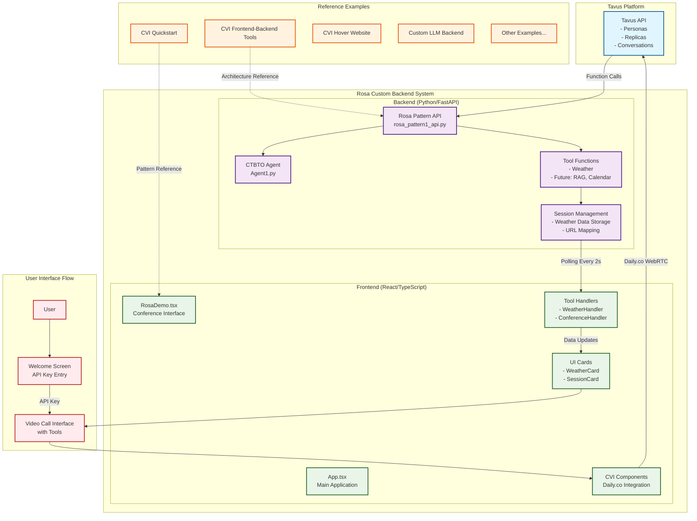
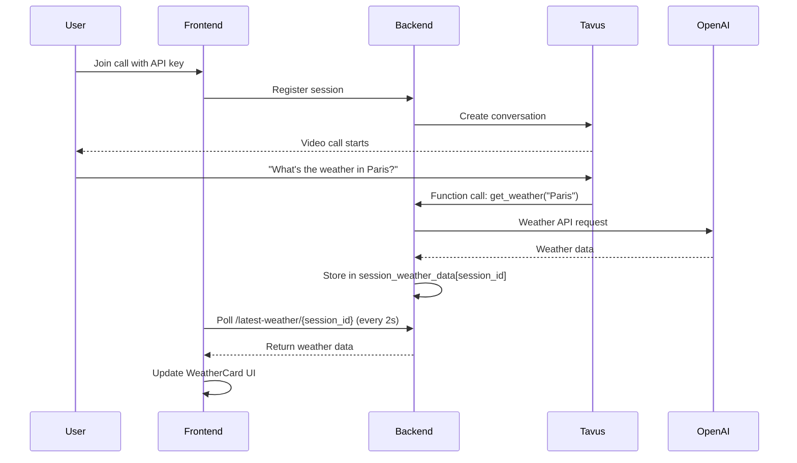

# CTBTO Avatar Project

A comprehensive AI-powered conversational video interface system for the CTBTO (Comprehensive Test Ban Treaty Organization), demonstrating advanced Tavus CVI technology for building interactive avatar experiences.

## 🎯 Overview

This repository showcases various implementations of Tavus's real-time video conversation platform, from simple quickstart examples to advanced custom backends with tool integration. Tavus enables developers to create human-like AI replicas that can see, hear, and respond in real-time video calls.

## 📋 Table of Contents

- [System Architecture](#-system-architecture)
- [Quick Start](#-quick-start) 
- [Project Structure](#-project-structure)
- [Rosa Custom Backend](#-rosa-custom-backend-flagship-example)
- [Reference Examples](#-reference-examples)
- [Core Concepts](#-core-concepts)
- [Development Guidelines](#-development-guidelines)
- [Support](#-support)

## 🏗 System Architecture

The CTBTO Avatar Project demonstrates a **polling-based generative UI architecture** for seamless integration of AI tools with video conversations:



### Key Architecture Principles

1. **Polling-Based Communication**: Frontend polls backend every 2 seconds for tool updates
2. **Session Isolation**: Each conversation maintains independent tool data
3. **Generative UI Pattern**: Tools generate UI updates without direct event coupling
4. **Decoupled Design**: Backend and frontend operate independently

## 🚀 Quick Start

### Prerequisites

- **Node.js** (v18 or higher)
- **Python** (v3.9 or higher)
- **Tavus API Key** from [platform.tavus.io](https://platform.tavus.io/)

### Option 1: Rosa Custom Backend (Recommended)

The **Rosa Custom Backend** is our flagship example with advanced tool integration:

```bash
# 1. Clone and navigate
git clone <repository-url>
cd CTBTO-Avatar-Project/Rosa_custom_backend

# 2. Install dependencies
npm install
cd backend && pip install -r requirements.txt

# 3. Set up environment
echo "OPENAI_API_KEY=your_openai_key_here" > backend/.env
echo "TAVUS_API_KEY=your_tavus_key_here" >> backend/.env

# 4. Start the system
npm run start  # Starts both backend and frontend with ngrok
```

### Option 2: Simple Quickstart

For a minimal example:

```bash
cd refrence_only/examples/cvi-quickstart-react
npm install
npm run dev
```

## 📁 Project Structure

```
CTBTO-Avatar-Project/
├── Rosa_custom_backend/           # 🌟 Main development environment
│   ├── backend/                   # Python FastAPI backend
│   │   ├── rosa_pattern1_api.py  # Core API with tool integration
│   │   ├── Agent1.py             # CTBTO conference agent
│   │   └── requirements.txt       # Python dependencies
│   ├── src/                       # React frontend
│   │   ├── components/           # UI components
│   │   └── App.tsx              # Main application
│   ├── dev_docs/                 # 📚 Development documentation
│   └── package.json              # Frontend dependencies
│
├── refrence_only/examples/        # 📖 Reference implementations
│   ├── cvi-quickstart-react/     # Basic CVI integration
│   ├── cvi-frontend-backend-tools/ # Tool integration example
│   ├── cvi-hover-over-website/   # Website overlay example
│   └── [other examples]/         # Additional use cases
│
└── package.json                  # Root dependencies
```

## 🌟 Rosa Custom Backend (Flagship Example)

The **Rosa Custom Backend** demonstrates advanced Tavus integration with:

### Features

- **🤖 AI Conference Assistant**: CTBTO conference planning agent
- **🌤️ Weather Tool Integration**: Real-time weather data with generative UI
- **📱 Session Management**: Multi-user conversation support
- **🔄 Polling Architecture**: Reliable tool-to-UI communication
- **📋 Development Framework**: Extensible pattern for new tools

### Core Logic Flow



### Tool Architecture

Every tool follows the same proven pattern:

**Backend (Python)**:
1. Define OpenAI function in tools list
2. Implement handler in `generate()` method  
3. Store results in `session_data[session_id]`
4. Expose via GET endpoint `/latest-{tool}/{session_id}`

**Frontend (React)**:
1. Create `{Tool}Handler.tsx` for polling logic
2. Create `{Tool}Card.tsx` for UI display
3. Use callback pattern for parent state updates

## 📖 Reference Examples

### Available Examples

| Example | Description | Technology Stack |
|---------|-------------|------------------|
| `cvi-quickstart-react` | Basic CVI integration | React, Daily.co |
| `cvi-frontend-backend-tools` | Tool integration demo | React, Python, FastAPI |
| `cvi-hover-over-website` | Website overlay CVI | React, CSS overlays |
| `cvi-ui-conversation` | Conference planning app | React, Complex state management |
| `cvi-transparent-background` | Green screen effects | React, WebGL |
| `start-stop-recording` | Call recording controls | React, Daily.co recording |

### Using Reference Examples

Each example is self-contained:

```bash
cd refrence_only/examples/[example-name]
npm install
npm run dev
```

## 🧠 Core Concepts

### 1. Tavus Conversation Flow

1. **Create Persona**: Define AI behavior and capabilities
2. **Create Replica**: Train visual appearance from video
3. **Start Conversation**: Generate WebRTC room URL
4. **Join Call**: User enters video conversation with AI

### 2. Tool Integration Pattern

**Generative UI**: Tools update the interface without direct event handling

```typescript
// Handler: Logic only, no UI
const WeatherHandler = ({ onWeatherUpdate }) => {
  useEffect(() => {
    if (meetingState !== 'joined-meeting') return;
    
    const interval = setInterval(async () => {
      const data = await fetch(`/latest-weather/${conversationId}`);
      if (data.ok) {
        const weather = await data.json();
        if (weather) onWeatherUpdate(weather);
      }
    }, 2000);
    
    return () => clearInterval(interval);
  }, [meetingState]);
  
  return null; // No rendering
};

// Card: UI only, no logic  
const WeatherCard = ({ data }) => (
  <div className="weather-card">
    <h3>{data.location}</h3>
    <p>{data.temperature}°F - {data.description}</p>
  </div>
);

// Parent: Orchestration
const App = () => {
  const [weatherData, setWeatherData] = useState(null);
  
  return (
    <>
      <WeatherHandler onWeatherUpdate={setWeatherData} />
      {weatherData && <WeatherCard data={weatherData} />}
    </>
  );
};
```

### 3. Session Management

Each conversation maintains isolated data:

```python
class RosaBackend:
    def __init__(self):
        self.sessions = {}  # session_id -> conversation_url
        self.session_weather_data = {}  # session_id -> weather_data
        self.session_rag_data = {}  # session_id -> rag_results
        # ... other tool data stores
```

## 🛠 Development Guidelines

### Adding New Tools

1. **Follow the Weather Pattern**: Copy `WeatherHandler.tsx` exactly
2. **Backend Implementation**: 
   - Add function to tools list
   - Implement handler in `generate()` method
   - Create session storage
   - Add GET endpoint

3. **Frontend Implementation**:
   - Create Handler component (polling logic)
   - Create Card component (UI display)  
   - Add to parent component

### Strict Rules

❌ **DO NOT**:
- Modify polling intervals (keep 2 seconds)
- Use WebSockets or real-time subscriptions
- Create complex event systems
- Over-engineer solutions

✅ **DO**:
- Follow established patterns exactly
- Maintain session isolation
- Use polling for all tool updates
- Keep handlers and cards separate

### Testing New Tools

```bash
# Test backend endpoint
curl http://localhost:8000/latest-{toolname}/test-session

# Test frontend polling
# Check browser console for polling requests
```

## 📚 Documentation

Comprehensive documentation is available in the Rosa Custom Backend:

- `Rosa_custom_backend/dev_docs/ai-agent-development-plan-tools.md` - Development guidelines
- `Rosa_custom_backend/dev_docs/generative-ui-pattern-explanation.md` - Architecture explanation  
- `Rosa_custom_backend/dev_docs/tavus.txt` - Complete Tavus API documentation

## 🔧 Environment Setup

### Required Environment Variables

```bash
# Rosa Custom Backend (.env in backend/)
OPENAI_API_KEY=your_openai_key_here
TAVUS_API_KEY=your_tavus_key_here
NODE_ENV=development

# Frontend (stored in localStorage)
VITE_TAVUS_API_KEY=your_tavus_key_here
```

### Development Tools

- **ngrok**: Exposes local backend for Tavus webhook integration
- **Daily.co**: WebRTC infrastructure (handled automatically by Tavus)
- **FastAPI**: Backend framework with automatic API documentation
- **React + TypeScript**: Frontend with type safety

## 🐛 Troubleshooting

### Common Issues

1. **Polling Not Working**: Check if `meetingState === 'joined-meeting'`
2. **Tool Data Missing**: Verify session registration and storage
3. **CORS Errors**: Ensure backend CORS configuration includes your frontend URL
4. **Function Calls Failing**: Check OpenAI API key and function definitions

### Debug Mode

```bash
# Enable detailed logging
export DEBUG=1
npm run start
```

## 🤝 Support

### Getting Help

1. **Documentation**: Check `dev_docs/` folder in Rosa Custom Backend
2. **Examples**: Browse `refrence_only/examples/` for patterns
3. **API Reference**: Complete Tavus documentation in `tavus.txt`

### Contributing

When contributing new examples or tools:

1. Follow the established weather tool pattern
2. Maintain session isolation
3. Use polling architecture (no WebSockets)
4. Include comprehensive documentation
5. Test with multiple concurrent sessions

---

**🚀 Ready to build AI-powered video conversations? Start with the Rosa Custom Backend for the complete development experience!** 