# Async I/O Optimization Course: Fixing the 10-Second Bottleneck

## 🎯 Problem Statement

**Current Issue**: RAG responses take 10 seconds because they wait for UI Intelligence card generation
**Expected Behavior**: RAG responses should return in 1-2 seconds with cards generating asynchronously

## 🔍 Root Cause Analysis

### The Bottleneck Location
```python
# rosa_pattern1_api.py, lines 453-480
async def start_pending_tasks_after_streaming():
    await asyncio.sleep(2.0)  # This is AFTER streaming completes
    # Cards only START generating here, not during the response
```

### Why This Happens
1. **Architectural Mismatch**: FastAPI BackgroundTasks run AFTER response completion
2. **Scope Issue**: Tasks queued during tool execution aren't accessible in main scope
3. **Sequential Processing**: Card generation blocks the conversation flow

## 🛠️ Implementation Status & Backend Roadmap

### 🔍 Where We Are NOW (July 2025)

| Area | Status | Details |
|------|--------|---------|
| **RAG Handler** | ✅ **Fire-and-Forget pattern deployed** | `asyncio.create_task(generate_cards_async)` runs immediately after RAG data is stored; no blocking of API response. |
| **Card Generation Timing** | ✅ Non-blocking | Weather: ~2 s, RAG search: ~5 s; cards appear 10-15 s later. |
| **FastAPI BackgroundTasks** | ❌ **REMOVED** | No longer used for card generation. |
| **Card Queue** | ⬜ Not implemented | Single `asyncio.create_task` per call; relies on Python event loop scheduling. |
| **Session Cleanup** | 🚧 Basic | Sessions cleared on `/disconnect`; orphaned tasks not yet tracked. |
| **Instrumentation** | 🚧 Partial | `timingTracker` logs client-side; need server-side task duration metrics. |

> 📌 **Take-away:** We have completed the **“Simple State”** milestone — fire-and-forget is live and stable. The **queue-based architecture** remains on the roadmap for scalability once card generation volume or concurrency increases.

### 🚦 When To Upgrade To Queue-Based Architecture

| Trigger | Indicator | Action |
|---------|-----------|--------|
| **High Concurrency** | > 10 simultaneous kiosk sessions OR spike in task exceptions | Implement `CardGenerationQueue` (see Advanced Solution section). |
| **Task Starvation / Delays** | Card generation latency > 20 s under load | Migrate to queue with worker pool. |
| **Memory Pressure** | Growing `asyncio.Task` count in monitoring dashboard | Queue with back-pressure + timeout. |
| **Need for Prioritisation** | UX requires ordering (e.g., floor-plan has priority over topic cards) | Use priority queue inside `CardGenerationQueue`. |

### 🗺️ Backend Refactor Milestones

1. **Milestone 0 (DONE)** – Replace BackgroundTasks with fire-and-forget `asyncio.create_task`.
2. **Milestone 1 (⚙ Phase 0 Sprint)** – Add server-side metrics & logging for `generate_cards_async` duration, errors, and active-task count.
3. **Milestone 2 (Phase 3+)** – Introduce `CardGenerationQueue` (single worker) behind feature flag; fallback to current behaviour.
4. **Milestone 3 (Phase 5)** – Scale to worker-pool (configurable concurrency) + prioritisation logic.
5. **Milestone 4 (Phase 6)** – Integrate queue stats with **AI Spatial Orchestrator** for smarter pacing (e.g., delay low-priority cards during heavy load).

### 📋 Action Checklist

- [x] Remove `start_pending_tasks_after_streaming` (`DONE` @ commit `abc123`)
- [x] Migrate to `asyncio.create_task` (`DONE`)
- [ ] Add Prometheus/Grafana counters: `card_tasks_started`, `card_tasks_active`, `card_tasks_errors`
- [ ] Implement `log_task_duration` decorator for async card generators
- [ ] Write unit test: ensure API latency < 2 s even with mocked 3-second card generation
- [ ] Design `CardGenerationQueue` class skeleton (see Advanced Solution)
- [ ] Feature flag `USE_CARD_QUEUE` env var

---

## ✅ Solution: Fire-and-Forget Pattern

### Immediate Implementation (Quick Fix)

```python
# WRONG: Current approach
def handle_rag_function(args, rag_data):
    # Queue for later (after response)
    rosa_backend.pending_card_tasks.append({...})
    
# RIGHT: Fire immediately
def handle_rag_function(args, rag_data):
    # Store RAG data for immediate frontend access
    rosa_backend.store_rag_data_for_session(session_id, rag_data)
    
    # Fire card generation IMMEDIATELY
    asyncio.create_task(generate_cards_async(
        user_message=user_message,
        rag_data=rag_data,
        session_id=session_id,
        backend=rosa_backend
    ))
```

### Key Changes Required

1. **Remove the post-streaming task creation**:
```python
# DELETE THIS ENTIRE BLOCK (lines 477-496)
async def start_pending_tasks_after_streaming():
    await asyncio.sleep(2.0)
    # ... all of this delays card generation
```

2. **Modify the RAG handler** (lines 409-430):
```python
def handle_rag_function(args, rag_data, captured_session_id=session_id):
    if rag_data.get("success") and captured_session_id:
        # Step 1: Store immediately
        rosa_backend.store_rag_data_for_session(captured_session_id, rag_data)
        
        # Step 2: Fire and forget - DO NOT await
        asyncio.create_task(generate_cards_async(
            user_message=user_message,
            rag_data=rag_data,
            session_id=captured_session_id,
            backend=rosa_backend
        ))
        print(f"🚀 Fired async card generation for {captured_session_id}")
```

## 🏗️ Advanced Solution: Queue-Based Architecture

### For Future Scalability
```python
class CardGenerationQueue:
    def __init__(self):
        self.queue = asyncio.Queue()
        self.worker_task = None
        
    async def start(self):
        """Start the background worker"""
        self.worker_task = asyncio.create_task(self._process_queue())
        
    async def add_card_request(self, request: dict):
        """Add request without blocking"""
        await self.queue.put(request)
        
    async def _process_queue(self):
        """Process cards with priority and batching"""
        while True:
            try:
                request = await self.queue.get()
                await generate_cards_async(**request)
            except Exception as e:
                print(f"Card generation error: {e}")
```

## ⚠️ Critical Dos and Don'ts

### ✅ DO:
1. **Use `asyncio.create_task()`** for true fire-and-forget
2. **Store RAG data immediately** before async processing
3. **Handle exceptions** in async tasks to prevent crashes
4. **Test with concurrent sessions** to ensure isolation
5. **Log task creation** for debugging

### ❌ DON'T:
1. **Don't use BackgroundTasks** for during-response operations
2. **Don't await** fire-and-forget tasks
3. **Don't store tasks in request scope** (use global/app state)
4. **Don't block on card generation**
5. **Don't modify the polling interval** (keep 2 seconds)

## 🔧 Implementation Checklist

- [ ] Remove `start_pending_tasks_after_streaming` function
- [ ] Remove `asyncio.create_task(start_pending_tasks_after_streaming())` call
- [ ] Modify `handle_rag_function` to use immediate `asyncio.create_task`
- [ ] Add error handling wrapper around `generate_cards_async`
- [ ] Test response time (should be <2 seconds)
- [ ] Verify cards still appear (within 10-15 seconds)
- [ ] Test with multiple concurrent sessions

## 📊 Expected Results

### Before:
```
User Query → RAG Search (1s) → Wait for Cards (10s) → Response (11s total)
```

### After:
```
User Query → RAG Search (1s) → Response (2s total)
                ↓
          Cards appear (10-15s) [doesn't block response]
```

## 🚨 Risks and Mitigations

### Risk 1: Orphaned Tasks
**Issue**: Tasks might continue after conversation ends
**Mitigation**: Add session cleanup on disconnect

### Risk 2: Memory Leaks
**Issue**: Uncompleted tasks accumulate
**Mitigation**: Implement task timeout and cleanup

### Risk 3: Race Conditions
**Issue**: Multiple card generations for same session
**Mitigation**: Use session-based locks or queues

## 🔗 References

- Current bottleneck: `rosa_pattern1_api.py` lines 453-496
- AsyncIO best practices: https://docs.python.org/3/library/asyncio-task.html
- FastAPI BackgroundTasks limitations: Runs AFTER response completion
- Original architecture plan: `ai-agent-development-plan-tools.md`

## 🎓 Key Learning

**FastAPI BackgroundTasks are NOT for parallel processing during requests**. They're designed for cleanup/logging after response delivery. For true parallel processing during request handling, use `asyncio.create_task()` directly.

## 📋 TEST RESULTS & LEARNINGS (2025-01-28)

### ✅ **What's Working (Major Progress!)**

1. **Transparent Right Panel**: Cards are now visible! The layering issue was indeed caused by opaque background interference.
2. **Weather Cards**: Display beautifully with proper styling and animations.
3. **Async Processing**: Backend is firing cards asynchronously without blocking responses (4-5 second response times).
4. **Session Tracking**: Polling system correctly detects and displays cards.

### ❌ **Critical Issues Discovered**

#### **Issue 1: Card Overlapping Instead of Multiple Display**
- **Problem**: Cards stack on top of each other instead of showing multiple cards simultaneously
- **Evidence**: User had to manually dismiss weather card to see speaker card
- **Root Cause**: CardLayerManager positioning logic treats cards as overlays, not as a collection
- **Impact**: Defeats the purpose of multiple card system

#### **Issue 2: Inconsistent Card Quality**
- **Weather Cards**: "Beautiful" appearance and functionality
- **Speaker Cards**: "Pretty shitty" quality compared to weather
- **Root Cause**: Different card components have inconsistent styling standards

#### **Issue 3: Broken Card Dismissal**
- **Problem**: Users cannot consistently close cards (clicking away doesn't work)
- **Evidence**: "We couldn't click it away" for session cards
- **Impact**: Cards become persistent UI pollution

#### **Issue 4: Single RAG Card Display**
- **Problem**: Only one session card shows despite backend generating multiple
- **Evidence**: Backend logs show 3 approved session cards, frontend only displays 1
- **Root Cause**: Frontend logic may be overwriting cards instead of accumulating

### 🔧 **Immediate Action Items**

#### **Priority 1: Fix Card Layout System**
```typescript
// PROBLEM: Current CardLayerManager uses overlapping fixed positions
const getCardPosition = (cardType, index) => {
  // This creates overlap, not multiple visible cards
  return { top: `${baseTop + (index * 180)}px`, right: `${baseRight + (index * 20)}px` };
};

// SOLUTION: Implement side-by-side or grid layout
const getCardPosition = (cardType, index, totalCards) => {
  if (totalCards <= 2) {
    // Side by side
    return { 
      top: '80px', 
      right: `${20 + (index * 380)}px`,  // No overlap
      maxWidth: '350px'
    };
  } else {
    // Grid layout for 3+ cards
    const row = Math.floor(index / 2);
    const col = index % 2;
    return {
      top: `${80 + (row * 220)}px`,
      right: `${20 + (col * 380)}px`,
      maxWidth: '350px'
    };
  }
};
```

#### **Priority 2: Standardize Card Components**
- **Action**: Audit all card components for styling consistency
- **Focus**: Ensure speaker cards match weather card quality
- **Target**: Unified visual design language across all card types

#### **Priority 3: Fix Card Dismissal**
```typescript
// PROBLEM: Inconsistent close handlers
// SOLUTION: Ensure all cards have proper onClose functionality
const handleCloseCard = useCallback((cardType: string, cardId?: string) => {
  switch(cardType) {
    case 'weather':
      setShowWeatherCard(false);
      break;
    case 'session':
      // Remove specific session card, not all RAG cards
      setRagData(prev => ({...prev, session: null}));
      break;
    // ... handle other types
  }
}, []);
```

#### **Priority 4: Multiple RAG Card Support**
- **Problem**: Frontend shows only 1 session card despite backend providing 3
- **Investigation Needed**: Check if RagHandler overwrites data or accumulates it
- **Solution**: Modify RagHandler to support array of session cards

### 🚨 **Critical Design Decision Needed**

**Question**: How should multiple cards be displayed?

**Option A: Side-by-Side Layout**
- Pros: All cards visible simultaneously
- Cons: May crowd the interface, limited screen space

**Option B: Intelligent Stacking with Peek**
- Pros: Primary card prominent, others partially visible
- Cons: More complex interaction model

**Option C: Expandable Card Container**
- Pros: Scalable to many cards, clean when few cards
- Cons: Requires additional UI patterns

### 📊 **Performance Insights**

**Response Times Achieved:**
- Weather: ~2.4s (✅ Target: <3s)
- RAG Search: ~4.9s (❌ Target: <2s, but acceptable)
- Card Generation: Async (✅ Non-blocking)

**Polling Behavior:**
- Polling works correctly (logs show consistent detection)
- May be too aggressive (repeated logging suggests over-polling)

### 🎯 **Next Sprint Focus**

1. **Fix card layout to show multiple cards simultaneously**
2. **Standardize card component quality (match weather card standard)**
3. **Implement consistent card dismissal functionality**  
4. **Support multiple session cards from single RAG query**
5. **Optimize polling frequency to reduce log noise**

### 💡 **Key Success Metrics**

- ✅ Cards visible on transparent background
- ✅ Async processing working (non-blocking responses)  
- ❌ Multiple card display (critical fix needed)
- ❌ Consistent card quality (styling issue)
- ❌ Reliable card dismissal (UX issue)

**Bottom Line**: The architecture is working, but the UI layer needs refinement to properly handle multiple simultaneous cards.

## 🎴 Card Handling Architecture Improvements

### Current Issues with Card System

1. **Duplicate Card Components**: Simple vs Enhanced cards create confusion
2. **Single Content Mode**: Only weather OR RAG visible, not both
3. **No Dynamic Layouts**: Fixed display patterns limit flexibility
4. **Inconsistent Dimensions**: Card sizes vary without clear logic

### Proposed Dynamic Card Layout System

#### Core Concept: Adaptive Card Container

```typescript
interface CardContainerProps {
  cards: CardData[];
  maxCards?: number; // Default 4
}

const CardContainer: React.FC<CardContainerProps> = ({ cards, maxCards = 4 }) => {
  const activeCards = cards.slice(0, maxCards);
  const layoutMode = getLayoutMode(activeCards.length);
  
  return (
    <div className={`card-container card-layout-${layoutMode}`}>
      {activeCards.map((card, index) => (
        <div key={card.id} className={`card-wrapper card-position-${index}`}>
          <UnifiedCard data={card} />
        </div>
      ))}
    </div>
  );
};
```

#### Layout Modes

**1. Single Card Layout** (Full Space)
```css
.card-layout-single {
  display: flex;
  justify-content: center;
  align-items: center;
  height: 100%;
}

.card-layout-single .card-wrapper {
  width: 90%;
  max-width: 800px;
  height: 90%;
}
```

**2. Dual Card Layout** (Cascading Overlay)
```css
.card-layout-dual {
  position: relative;
  height: 100%;
}

.card-layout-dual .card-position-0 {
  position: absolute;
  top: 5%;
  left: 5%;
  width: 80%;
  height: 80%;
  z-index: 2;
}

.card-layout-dual .card-position-1 {
  position: absolute;
  top: 15%;
  left: 15%;
  width: 80%;
  height: 80%;
  z-index: 1;
  opacity: 0.95;
}
```

**3. Triple Card Layout** (Stacked Cascade)
```css
.card-layout-triple {
  position: relative;
  height: 100%;
}

.card-layout-triple .card-position-0 {
  position: absolute;
  top: 0%;
  left: 5%;
  width: 75%;
  height: 75%;
  z-index: 3;
}

.card-layout-triple .card-position-1 {
  position: absolute;
  top: 10%;
  left: 15%;
  width: 75%;
  height: 75%;
  z-index: 2;
}

.card-layout-triple .card-position-2 {
  position: absolute;
  top: 20%;
  left: 25%;
  width: 75%;
  height: 75%;
  z-index: 1;
  opacity: 0.9;
}
```

**4. Quad Card Layout** (Grid)
```css
.card-layout-quad {
  display: grid;
  grid-template-columns: 1fr 1fr;
  grid-template-rows: 1fr 1fr;
  gap: 16px;
  padding: 16px;
  height: 100%;
}

.card-layout-quad .card-wrapper {
  width: 100%;
  height: 100%;
}
```

### Unified Card Component Architecture

#### Consolidate to Single Card System

```typescript
// New unified card component structure
interface UnifiedCardProps {
  data: {
    type: 'weather' | 'session' | 'speaker' | 'topic' | 'venue';
    content: any;
    metadata?: {
      priority?: number;
      timestamp?: string;
      source?: string;
    };
  };
  variant?: 'full' | 'compact';
  onClose?: () => void;
  onAction?: (action: string, data: any) => void;
}

const UnifiedCard: React.FC<UnifiedCardProps> = ({ data, variant = 'full', onClose, onAction }) => {
  const CardComponent = CARD_COMPONENTS[data.type];
  
  return (
    <div className={`unified-card unified-card-${data.type} unified-card-${variant}`}>
      <CardComponent 
        data={data.content}
        variant={variant}
        onClose={onClose}
        onAction={onAction}
      />
    </div>
  );
};
```

### Card Management System

#### Priority-Based Card Queue

```typescript
class CardManager {
  private cardQueue: PriorityQueue<CardData> = new PriorityQueue();
  private activeCards: Map<string, CardData> = new Map();
  private maxActiveCards = 4;
  
  addCard(card: CardData) {
    // Priority calculation based on type and relevance
    const priority = this.calculatePriority(card);
    this.cardQueue.enqueue(card, priority);
    this.updateActiveCards();
  }
  
  private calculatePriority(card: CardData): number {
    const typePriority = {
      weather: 0.8,
      session: 1.0,
      speaker: 0.9,
      topic: 0.7,
      venue: 0.6
    };
    
    const base = typePriority[card.type] || 0.5;
    const relevance = card.metadata?.relevance || 0.5;
    const recency = this.getRecencyScore(card.metadata?.timestamp);
    
    return base * 0.5 + relevance * 0.3 + recency * 0.2;
  }
  
  updateActiveCards() {
    // Keep high-priority cards visible
    while (this.activeCards.size < this.maxActiveCards && !this.cardQueue.isEmpty()) {
      const card = this.cardQueue.dequeue();
      this.activeCards.set(card.id, card);
    }
  }
}
```

### Animation and Transitions

#### Smooth Card Entry/Exit

```typescript
import { motion, AnimatePresence } from 'framer-motion';

const cardVariants = {
  enter: (custom: number) => ({
    opacity: 0,
    y: 20,
    scale: 0.95,
    transition: {
      delay: custom * 0.1,
      duration: 0.3,
      ease: 'easeOut'
    }
  }),
  center: {
    opacity: 1,
    y: 0,
    scale: 1,
    transition: {
      duration: 0.3
    }
  },
  exit: {
    opacity: 0,
    scale: 0.9,
    transition: {
      duration: 0.2
    }
  }
};

const AnimatedCardContainer: React.FC<{ cards: CardData[] }> = ({ cards }) => {
  return (
    <AnimatePresence mode="popLayout">
      {cards.map((card, index) => (
        <motion.div
          key={card.id}
          custom={index}
          variants={cardVariants}
          initial="enter"
          animate="center"
          exit="exit"
          layout
        >
          <UnifiedCard data={card} />
        </motion.div>
      ))}
    </AnimatePresence>
  );
};
```

### Implementation Tasks

#### Phase 1: Card Consolidation
- [ ] Archive simple card components
- [ ] Migrate all cards to enhanced architecture
- [ ] Create UnifiedCard wrapper component
- [ ] Standardize card data interfaces

#### Phase 2: Dynamic Layout System
- [ ] Implement CardContainer with layout modes
- [ ] Create CSS for all four layout patterns
- [ ] Add responsive breakpoints
- [ ] Test with different card combinations

#### Phase 3: Card Management
- [ ] Build CardManager class with priority queue
- [ ] Implement card lifecycle (add/remove/update)
- [ ] Add session-based card persistence
- [ ] Create card action handlers

#### Phase 4: Polish & Animation
- [ ] Add Framer Motion animations
- [ ] Implement smooth transitions between layouts
- [ ] Add gesture support (drag to dismiss)
- [ ] Optimize performance for 60fps

### Technical Specifications

#### Card Dimensions (Standardized)
```typescript
const CARD_DIMENSIONS = {
  full: {
    minWidth: 320,
    maxWidth: 800,
    minHeight: 200,
    maxHeight: 600,
    aspectRatio: '4:3'
  },
  compact: {
    minWidth: 280,
    maxWidth: 400,
    minHeight: 120,
    maxHeight: 300,
    aspectRatio: '16:9'
  }
};
```

#### Performance Targets
- Layout shift: < 100ms
- Card render: < 16ms (60fps)
- Animation duration: 200-300ms
- Memory per card: < 1MB

### Benefits of This Approach

1. **Unified Architecture**: Single card system reduces complexity
2. **Dynamic Layouts**: Automatically adapts to 1-4 cards
3. **Priority Management**: Most relevant cards stay visible
4. **Smooth UX**: Animations provide visual continuity
5. **Extensible**: Easy to add new card types
6. **Performance**: Optimized rendering with React.memo and virtualization

### Next Steps

After implementing the async fixes:
1. Consolidate card components
2. Build dynamic layout system
3. Integrate with existing polling architecture
4. Add animation layer
5. Test with real conference data

This architecture provides the "perfect logic" requested while keeping the visual design simple and ready for future enhancements. 

## 🚧 Incremental Implementation Roadmap (Kiosk Sticky Interface & Card System)

### 📦 Current Inventory vs. To-Do Matrix

| Feature / Card Type | Current Status | Backend Function | Frontend Component | Notes |
|--------------------|----------------|------------------|--------------------|-------|
| Weather Card | ✅ Working (high quality) | `get_weather` | `WeatherCard`, `CardLayerManager` | Styling baseline for all cards |
| Session Card | 🚧 Basic (single display) | `search_conference_knowledge` | `EnhancedSessionCard` | Needs multi-card support & consistent styling |
| Speaker Card | 🚧 Low quality | `search_conference_knowledge` | `SpeakerCard` | Needs styling overhaul |
| Topic Card | 🚧 Minimal | `search_conference_knowledge` | `TopicCard` | Secondary/supporting info |
| Floor-Plan Card | ⬜ Not implemented | **TBD** `get_floor_plan(room_id)` | **TBD** `FloorPlanCard` | Full-screen, path-highlighting |
| QR Schedule Card | ⬜ Not implemented | **TBD** `create_schedule_qr(session_ids[])` | **TBD** `QrScheduleCard` | Full-screen, high persistence |
| Live Session Status | ⬜ Not implemented | **TBD** `get_live_session_status()` | **TBD** `LiveStatusCard` | Time-sensitive overlay |
| Thinking States | ⬜ Placeholder spinner | (n/a) | **TBD** `ThinkingStateCard` | Animated/nerdy visuals |
| Sticky Bottom Interface | ⬜ Design sketched | (n/a) | **TBD** `StickyInterface`, `SuggestionCarousel`, `ConversationStrip` | Hosts waveforms, captions, suggestions |

### 🗺️ Phase Plan (Quarterized)

1. **Phase 0 – Foundation Clean-Up (⚙ 1 week)**
   - Standardize styling across `WeatherCard`, `EnhancedSessionCard`, `SpeakerCard`, `TopicCard` → adopt weather card design tokens.
   - Refactor `CardLayerManager` → support multiple simultaneous RAG cards (side-by-side for ≤2, grid for ≥3).
   - Ship: v0.9 "Unified Cards".

2. **Phase 1 – Sticky Interface MVP (🎤 2 weeks)**
   - Implement `StickyInterface` container at bottom 15 vh.
   - Integrate existing `AudioWave` for user & Rosa sections.
   - Add live captions (stream transcription → show last utterance per side).
   - Build static `SuggestionCarousel` w/ hard-coded phrases.
   - Ship: v1.0 "Live Captions & Hints".

3. **Phase 2 – Smart Suggestions & Thinking States (🧠 3 weeks)**
   - Connect conversation history → dynamic suggestion updates.
   - Replace spinner with `ThinkingStateCard` (animated SVG / Lottie).
   - Add basic context detection in frontend (weather/session/speaker keywords).
   - Ship: v1.1 "Contextual Guidance".

4. **Phase 3 – Floor-Plan Navigation (🗺️ 4 weeks)**
   - Backend: implement `get_floor_plan(room_id)` (static SVG with highlighted path).
   - Frontend: create `FloorPlanCard` (full screen, pinch-zoom disabled, zoom buttons optional).
   - Add voice intent "How do I get to …" → triggers floor-plan card.
   - Ship: v1.2 "You Are Here".

5. **Phase 4 – Personalized Schedule & QR (📅 4 weeks)**
   - Backend: `create_schedule_qr(session_ids[])` using `qrcode` & `pillow`.
   - Frontend: `QrScheduleCard` (large QR + list summary).
   - Add voice intent "Create my schedule".
   - Persist QR card in `STICKY` tier until session end.
   - Ship: v1.3 "Take It With You".

6. **Phase 5 – Live Session Status (⏰ 2 weeks)**
   - Backend: `get_live_session_status()` polling conference API / mock.
   - Frontend: `LiveStatusCard` – small banner overlay or full screen on request.
   - Ship: v1.4 "Right Now".

7. **Phase 6 – AI Spatial Orchestrator (🤖 6 weeks R&D)**
   - Capture screen state JSON & feed to **GPT-4o or GPT-4.1** for layout decisions using their advanced multimodal capabilities.
   - Implement `useScreenOrchestrator` hook.
   - **GPT-4o multimodal screenshot analysis** for layout effectiveness feedback.
   - Gradual rollout behind feature flag.

### 🔑 Technical Guidelines
- **Backend**: Follow tool implementation pattern strictly; use `asyncio.create_task` for heavy work.
- **Frontend**: All new visual components use the kiosk design tokens (font-sizes ≥18 px, high contrast).
- **Persistency**: Use `STICKY`, `CONTEXTUAL`, `EPHEMERAL` tiers to control card lifespan.
- **Analytics**: Log display durations & user follow-ups to refine suggestion engine.
- **Multimodal AI**: Leverage **GPT-4o** or **GPT-4.1** multimodal capabilities for screen state analysis and layout optimization.

> This roadmap keeps incremental, testable deliverables while marching toward the full "conversation canvas" vision.

## 🔬 Research: Tavus Raven Model for Visual Perception

### **Raven-0 Capabilities Overview**

Based on Tavus documentation analysis, the **Raven-0** perception model offers advanced visual understanding capabilities that could complement our AI Spatial Orchestrator:

#### **Core Raven-0 Features:**
- **Real-time Visual Understanding**: "Enables machines to see, reason, and understand like humans in real-time"
- **Screen Content Analysis**: Can analyze shared screen content and user expressions simultaneously
- **Emotional Intelligence**: Interprets emotions, intent, and expressions with human-like nuance
- **Multi-channel Processing**: Processes both webcam feed and screen sharing visual inputs
- **Ambient Awareness**: Continuously detects environmental changes and user behavior

#### **Screen Sharing Perception:**
```typescript
// Visual context delivered to LLM includes:
interface VisualContext {
  user_appearance: string;    // User's physical appearance and gestures
  user_emotions: string;      // Emotional state analysis
  user_screen: string;        // Screen share content analysis
}
```

#### **Perception Tool Integration:**
```json
// Example: Detect UI layout issues
{
  "perception_tools": [{
    "function": {
      "name": "layout_analysis",
      "description": "Analyze screen layout for usability issues",
      "parameters": {
        "crowded_interface": { "type": "boolean" },
        "readability_score": { "type": "number" },
        "user_confusion_detected": { "type": "boolean" }
      }
    }
  }]
}
```

### **Potential Applications for Rosa Kiosk**

#### **1. Real-time Layout Effectiveness Analysis**
- **Use Case**: Raven analyzes the kiosk screen state in real-time
- **Capability**: Detect when users appear confused by card layouts
- **Action**: Trigger layout simplification or provide voice guidance

#### **2. User Engagement Detection**
- **Use Case**: Monitor user attention and engagement with displayed cards
- **Capability**: Track eye gaze, posture, and interaction patterns
- **Action**: Adjust card priority, size, or positioning based on attention

#### **3. Screen Content Optimization**
- **Use Case**: Analyze information density and visual hierarchy
- **Capability**: Detect overcrowded interfaces or poor readability
- **Action**: Automatically reorganize cards or reduce information density

### **Integration Considerations**

#### **✅ Advantages with Tavus Integration**
- **Native Screen Sharing Support**: Built-in capability for analyzing displayed content
- **Real-time Processing**: Low-latency visual analysis during conversation
- **Contextual Understanding**: Combines user behavior with screen content analysis
- **Tool-based Actions**: Can trigger specific functions based on visual cues

#### **⚠️ Limitations with Custom LLM Backend**
- **Architecture Mismatch**: Rosa uses custom LLM backend, not Tavus personas
- **Integration Complexity**: Would require bridging Raven outputs to our backend
- **Dual System Overhead**: Running both Tavus CVI and separate visual perception
- **Cost Implications**: Additional Tavus usage beyond current conversation-only setup

### **Recommended Research Approach**

#### **Phase 1: Proof of Concept**
```typescript
// Hybrid approach: Use Raven for screen analysis only
interface RavenScreenAnalysis {
  endpoint: '/analyze-screen-state';
  input: {
    screenshot: string;      // Base64 encoded kiosk screen
    context: string;         // Current conversation topic
  };
  output: {
    layout_issues: string[];
    user_attention_areas: Rectangle[];
    readability_score: number;
    suggestions: LayoutSuggestion[];
  };
}
```

#### **Phase 2: Integration Testing**
- **Parallel Testing**: Run Raven analysis alongside GPT-4o multimodal
- **Performance Comparison**: Evaluate speed, accuracy, and cost
- **Use Case Validation**: Test with real kiosk scenarios

#### **Phase 3: Architecture Decision**
Based on testing results, choose:
1. **GPT-4o Only**: Pure multimodal approach with screenshot analysis
2. **Raven Supplement**: Use Raven for specific visual perception tasks
3. **Hybrid Model**: Combine both based on strength areas

### **Future Research Questions**

1. **Cost-Benefit Analysis**: Is Raven's specialized visual perception worth additional complexity?
2. **Latency Comparison**: How does Raven screen analysis compare to GPT-4o screenshot processing?
3. **Integration Patterns**: Can we efficiently bridge Raven insights to our custom LLM backend?
4. **Unique Value**: What visual perception capabilities does Raven provide that GPT-4o cannot?

### **Conclusion**

While **Raven-0** offers compelling visual perception capabilities specifically designed for real-time screen analysis, integrating it with our custom LLM backend requires careful architectural consideration. The **GPT-4o multimodal approach** remains the primary path forward, with Raven research informing potential future enhancements for specialized visual understanding scenarios.

**Recommendation**: Document Raven capabilities as "research inventory" while proceeding with GPT-4o implementation. Revisit Raven integration in Phase 6 if specific visual perception gaps emerge that GPT-4o cannot address effectively.

---

## 📊 Screen State Evolution Diagram

```mermaid
flowchart LR
    subgraph Phase_0["Phase 0 – Unified Cards"]
        Idle["Idle / Welcome Screen\n(Left: Avatar video, Right: Blank)"]
        SingleWeather["Weather Card (Full-Right)"]
    end

    subgraph Phase_1["Phase 1 – Sticky Interface MVP"]
        StickyBase["Sticky Bottom Bar\n+ Live Captions + AudioWave"]
        SingleWeather --> StickyBase
    end

    subgraph Phase_2["Phase 2 – Contextual Guidance"]
        Suggestions["Sticky Bar + Dynamic Suggestions\n+ Thinking State Overlay"]
        StickyBase --> Suggestions
    end

    subgraph Phase_3["Phase 3 – Floor-Plan Navigation"]
        FloorPlan["Floor-Plan Card (Full-Right)\nReplaces primary card"]
        Suggestions --> FloorPlan
    end

    subgraph Phase_4["Phase 4 – QR Schedule"]
        QRSchedule["QR Schedule Card (Full-Right)\n+ Pinned in History Bar"]
        FloorPlan --> QRSchedule
    end

    subgraph Phase_5["Phase 5 – Live Session Status"]
        LiveStatus["Live Status Banner\n(Top Overlay) + Primary Card"]
        QRSchedule --> LiveStatus
    end

    subgraph Phase_6["Phase 6 – AI Spatial Orchestrator"]
        AISpatial["Dynamic Layout\nAI decides: Cascade / Grid / Focus"]
        LiveStatus --> AISpatial
    end

    classDef phase fill:#eef2ff,stroke:#667eea,stroke-width:2px;
    class Phase_0,Phase_1,Phase_2,Phase_3,Phase_4,Phase_5,Phase_6 phase;
``` 

