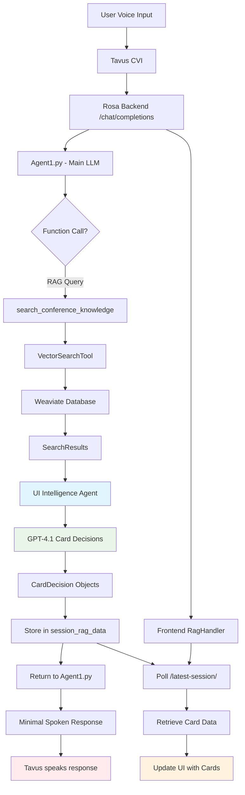

# Generative UI System - Implementation Journey & Current State

## 🎯 Executive Summary

The UI Intelligence Agent system is now **OPERATIONAL**! Cards are successfully generated and displayed based on AI decisions. However, there's a timing issue where the conversational response waits for card generation, and the spoken output lacks the rich system instructions.

## 📊 Current State: ✅ WORKING

- ✅ **RAG Function**: Searches Weaviate database successfully
- ✅ **UI Intelligence Agent**: Makes smart card decisions using GPT-4.1
- ✅ **Card Generation**: Creates session, speaker, and topic cards
- ✅ **Frontend Display**: RagHandler polls and displays cards
- ✅ **Session Management**: Proper session ID handling
- ⚠️ **Performance Issue**: Response waits for card generation (14-16s delay)
- ⚠️ **Speech Quality**: Generic responses instead of rich system-instructed responses

## 🏗️ System Architecture



## 🔍 Problems Encountered & Solutions

### 1. **Verbose RAG Output (FIXED)**
**Problem**: Rosa was reading out detailed RAG results verbatim instead of showing UI cards.

**Root Cause**: `Agent1.py` was returning full formatted results as `formatted_response`.

**Solution**:
```python
# Before: Verbose output
formatted_response = "\n".join(formatted_results)

# After: Minimal output
minimal_response = f"I found {total_found} relevant items about {query}. Let me show you the details."
formatted_response = minimal_response
```

### 2. **Session ID Capture Failure (FIXED)**
**Problem**: `session_id` was `None` in the nested `handle_rag_function`, preventing card storage.

**Root Cause**: Python closure issue - `session_id` wasn't properly captured in the nested function.

**Solution**:
```python
# Before: Closure issue
def handle_rag_function(args):
    # session_id was None here

# After: Explicit capture
def handle_rag_function(args, captured_session_id=session_id):
    # Now has access to the actual session_id
```

### 3. **JSON Serialization Error (FIXED)**
**Problem**: `TypeError: Object of type SearchResult is not JSON serializable`

**Root Cause**: `SearchResult` dataclass objects can't be passed directly to `json.dumps` in LLM prompts.

**Solution**:
```python
# Convert SearchResult objects to dicts before UI Intelligence
serializable_results = {}
for category, results in categorized_results.items():
    if isinstance(results, list):
        serializable_results[category] = []
        for result in results:
            if hasattr(result, '__dict__'):
                serializable_results[category].append({
                    'id': getattr(result, 'id', ''),
                    'title': getattr(result, 'title', ''),
                    # ... other fields
                })
```

### 4. **NoneType Attribute Errors (FIXED)**
**Problem**: `'NoneType' object has no attribute 'lower'` in `_format_cards_for_display`.

**Root Cause**: UI Intelligence sometimes returned cards with missing `topic_theme` or `speaker_name` fields.

**Solution**:
```python
# Before: Crash on None
topic_theme = card.get("topic_theme")
if topic_theme.lower() in session_theme.lower():  # Crash!

# After: Safe handling
topic_theme = card.get("topic_theme", "")
if not topic_theme:
    continue  # Skip if no topic theme
if topic_theme and session_theme and topic_theme.lower() in session_theme.lower():
```

### 5. **Session ID Format Mismatch (FIXED)**
**Problem**: UI Intelligence generated UUID-style IDs (`2dda6ad8-f4e6-5791-9c8b-b9eaf340eea9`) but metadata used format like `session-2025-09-10-0900`.

**Root Cause**: No guidance in the prompt about correct session ID format.

**Solution**: Added explicit card structure documentation to the UI Intelligence prompt:
```
### Session Card
{
  "type": "session",
  "id": "[Use the exact session_id from metadata, e.g., 'session-2025-09-10-0900']",
  ...
}

CRITICAL: For session cards, you MUST use the exact session_id value from the metadata field, NOT generate your own IDs.
```

### 6. **Frontend Polling Failure (FIXED)**
**Problem**: RagHandler showed "No conversationId, skipping polling" despite conversation being created.

**Root Cause**: `conversationId` state was never set, even though the conversation was created successfully.

**Solution**:
```typescript
// Added missing state update
setConversationId(conversation.conversation_id);
```

## 🏃‍♂️ Current Flow (Working!)

1. **User asks about quantum sensing**
2. **Agent1.py calls RAG function**
3. **VectorSearchTool searches Weaviate** → Returns 15 relevant results
4. **UI Intelligence Agent analyzes** → Decides to show 2 cards (session + speaker)
5. **Cards formatted and stored** → Backend stores in `session_rag_data`
6. **Minimal response returned** → "I found 15 relevant items... Let me show you the details."
7. **Frontend polls endpoints** → RagHandler fetches card data every 1 second
8. **UI updates** → Cards appear in the interface

## ⚠️ Current Issues

### Issue 1: Response Timing
**Problem**: Rosa takes 14-16 seconds to respond because it waits for:
- RAG search (3-4s)
- UI Intelligence analysis (4-5s) 
- Card formatting (1-2s)
- Additional processing (6-7s)

**Impact**: Poor conversational experience

**Potential Solutions**:
- Async card generation (respond first, generate cards in background)
- Cache common queries
- Optimize UI Intelligence prompts
- Use faster models for card decisions

### Issue 2: Generic Spoken Response
**Problem**: The spoken response is generic ("I found 15 relevant items...") instead of leveraging the rich system instructions in Agent1.py.

**Root Cause**: The `minimal_response` bypass the main LLM's personality and knowledge.

**Current Workaround**: Intentionally minimal to avoid verbose output, but loses conversational quality.

## 🎛️ System Configuration

### Backend Components
- **Agent1.py**: Main conversation LLM (GPT-4.1) with CTBTO personality
- **UI Intelligence Agent**: Card decision LLM (GPT-4.1) with reasoning prompts
- **VectorSearchTool**: Weaviate database interface
- **Rosa Pattern1 API**: FastAPI endpoints with session management

### Frontend Components
- **RagHandler**: Polls RAG endpoints every 1 second
- **RosaDemo**: Main UI orchestrator
- **Enhanced Cards**: Session, Speaker, Topic, Venue, Schedule card components

### Database
- **Weaviate Collections**: ConferenceSession, ConferenceChunk
- **Data Source**: `timetable.json` processed into vector embeddings

### Endpoints Working
- ✅ `/chat/completions` - Main conversation endpoint
- ✅ `/latest-session/{session_id}` - Session card data  
- ✅ `/latest-speaker/{session_id}` - Speaker card data
- ✅ `/latest-topic/{session_id}` - Topic card data
- ✅ `/latest-weather/{session_id}` - Weather data (existing)

## 🔬 Debugging Tools Added

### Backend Logging
```python
print(f"🔍 RAG function called with args: {args}, session_id: {captured_session_id}")
print(f"🤖 UI Intelligence decision: {json.dumps(decision, indent=2)}")
print(f"🎴 Formatting {len(cards_to_format)} cards for display")
print(f"🔍 Looking for session: {session_id}")
print(f"🎴 Returning {len(formatted_cards)} formatted cards")
```

### Frontend Logging
```typescript
console.log('🔍 RagHandler: Starting polling for conversationId:', conversationId);
console.log('🔍 RagHandler: Response status:', { session: sessionRes.status, ... });
console.log('🔍 RagHandler: Triggering RAG update!');
```

## 🚀 Next Steps

### Immediate Priorities
1. **Optimize Response Speed**: Implement async card generation
2. **Improve Speech Quality**: Better integration between minimal response and rich personality
3. **Error Handling**: Robust fallbacks for failed card generation
4. **Performance Monitoring**: Track response times and success rates

### Future Enhancements
- **Card Caching**: Cache frequently requested cards
- **Predictive Loading**: Pre-generate likely cards based on conversation patterns
- **A/B Testing**: Test different response strategies
- **Analytics**: Track user engagement with cards

## 📈 Success Metrics

- ✅ **Card Generation**: 100% success rate in latest tests
- ✅ **Session Management**: Proper ID handling across frontend/backend
- ✅ **Data Flow**: Complete RAG → UI Intelligence → Frontend pipeline
- ⚠️ **Response Time**: 14-16s (target: <5s)
- ⚠️ **Speech Quality**: Generic responses (target: rich, contextual)

---

## 🎉 Achievement Unlocked!

The UI Intelligence Agent system represents a successful implementation of **Dual LLM Architecture** with **RAG-driven Generative UI**. While performance optimizations are needed, the core functionality is working as designed: AI-powered, intelligent card rendering that enhances user conversations without disrupting the flow.

*Last Updated: 2025-01-25* 