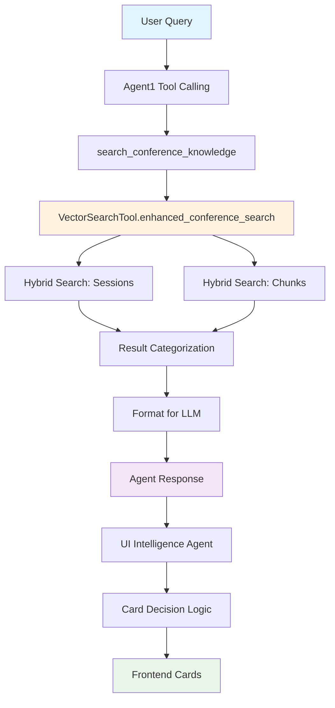
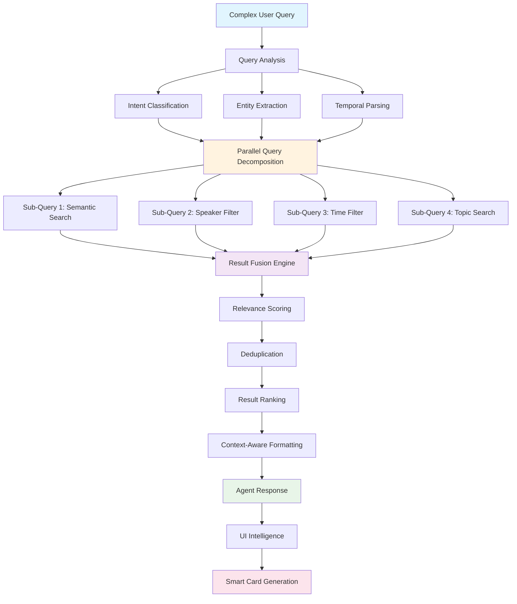

# RAG Query Processing & Information Flow Analysis

## Executive Summary

This document analyzes the RAG (Retrieval-Augmented Generation) system implementation, focusing on query decomposition, parallelization strategies, search types, and filtering mechanisms. The system uses **Weaviate** as the vector database and implements sophisticated query processing patterns for conference data retrieval.

## System Architecture Overview

The RAG system operates through multiple interconnected components:

### Core Components
1. **VectorSearchTool** - Main search interface with 5 search types
2. **Agent1** - Primary conversation agent with tool calling
3. **UIIntelligenceAgent** - Smart card rendering decisions
4. **Weaviate** - Vector database with hybrid search capabilities

### Data Collections
- **ConferenceChunk** - Contextual content pieces
- **ConferenceSession** - Session metadata and descriptions
- **Speaker profiles** - Extracted from session data
- **Topics** - Thematic categorizations

## Query Types & Search Strategies

### 1. Semantic Search
```python
def semantic_search(self, query: str, collection: str, limit: int = 5, 
                   filters: Optional[Dict[str, Any]] = None) -> List[SearchResult]:
    """
    Vector similarity search using OpenAI embeddings
    Best for: Conceptual queries, meaning-based search
    """
    response = coll.query.near_text(
        query=query,
        limit=limit,
        where=where_filter,
        return_metadata=wq.MetadataQuery(distance=True)
    )
```

**Use Cases:**
- "nuclear monitoring technologies"
- "seismic detection methods"
- "quantum sensing applications"

**Characteristics:**
- Uses vector embeddings for semantic similarity
- Distance-based relevance scoring (0-2 scale, converted to 0-1)
- Handles conceptual and contextual queries

### 2. Keyword Search (BM25)
```python
def keyword_search(self, query: str, collection: str, limit: int = 5,
                  filters: Optional[Dict[str, Any]] = None) -> List[SearchResult]:
    """
    Lexical search using BM25 algorithm
    Best for: Exact term matching, fast retrieval
    """
    response = coll.query.bm25(
        query=query,
        limit=limit,
        where=where_filter,
        return_metadata=wq.MetadataQuery(score=True)
    )
```

**Use Cases:**
- Exact speaker names: "Dr. Elizabeth Hayes"
- Specific session IDs or codes
- Precise technical terms

**Characteristics:**
- Term frequency and document frequency based
- Fast execution for exact matches
- Score-based relevance ranking

### 3. Hybrid Search (Primary Strategy)
```python
def hybrid_search(self, query: str, collection: str, limit: int = 5,
                 filters: Optional[Dict[str, Any]] = None, alpha: float = 0.5) -> List[SearchResult]:
    """
    Combines semantic and keyword search
    Best for: Balanced results, general-purpose search
    alpha: 0.0 = pure keyword, 1.0 = pure semantic, 0.5 = balanced
    """
    response = coll.query.hybrid(
        query=query,
        limit=limit,
        where=where_filter,
        alpha=alpha,
        return_metadata=wq.MetadataQuery(score=True)
    )
```

**Use Cases:**
- General conference queries: "quantum sensing workshops"
- Mixed intent queries: "Dr. Chen machine learning"
- Balanced precision and recall needs

**Characteristics:**
- Fusion of semantic and lexical search
- Configurable weighting via alpha parameter
- Weaviate's Relative Score Fusion algorithm

### 4. Filtered Search
```python
def filtered_search(self, filters: Dict[str, Any], collection: str, limit: int = 10):
    """
    Pure metadata-based filtering without query text
    Best for: Structured queries, specific constraints
    """
    response = coll.query.fetch_objects(
        where=where_filter,
        limit=limit
    )
```

**Use Cases:**
- Time-based filters: `{"date": {"gte": "2025-09-10"}}`
- Venue restrictions: `{"venue": "Festsaal"}`
- Speaker-specific sessions: `{"speakers": ["Dr. Sarah Chen"]}`

### 5. RAG Search
```python
def rag_search(self, query: str, collection: str, limit: int = 5,
              filters: Optional[Dict[str, Any]] = None) -> Dict[str, Any]:
    """
    Retrieval for generation - returns search results only
    Generation handled by main ROSA agent
    """
    # Pure vector search to avoid double LLM calls
    response = coll.query.near_text(query=query, limit=limit)
    
    return {
        "search_results": search_results,
        "query": query,
        "collection": collection,
        "success": True
    }
```

**Characteristics:**
- Optimized for RAG workflows
- Prevents duplicate LLM generation calls
- Returns structured data for agent processing

## Filtering Mechanisms

### Property-Based Filters
```python
def _build_filters(self, filter_spec: Dict[str, Any]) -> Optional[wq.Filter]:
    """Convert filter specification to Weaviate filters"""
    filters = []
    for field, value in filter_spec.items():
        if isinstance(value, list):
            # Array fields: related_topics, authors
            filters.append(wq.Filter.by_property(field).contains_any(value))
        elif isinstance(value, bool):
            filters.append(wq.Filter.by_property(field).equal(value))
        elif isinstance(value, dict):
            # Range queries
            if "gte" in value:
                filters.append(wq.Filter.by_property(field).greater_or_equal(value["gte"]))
            if "lte" in value:
                filters.append(wq.Filter.by_property(field).less_or_equal(value["lte"]))
        else:
            filters.append(wq.Filter.by_property(field).equal(value))
    
    # Combine with AND logic
    return combined_filter
```

### Filter Types Supported

| Filter Type | Example | Use Case |
|-------------|---------|----------|
| **Equality** | `{"venue": "Festsaal"}` | Exact matches |
| **Range** | `{"points": {"gte": 200}}` | Numerical ranges |
| **Array Contains** | `{"topics": ["seismic", "ML"]}` | Multi-value fields |
| **Boolean** | `{"is_interactive": true}` | Binary properties |
| **Date Range** | `{"date": {"gte": "2025-09-10"}}` | Time constraints |

### Combined Filtering Examples
```python
# Complex filter: Morning workshops with specific topics
filters = {
    "time_of_day": "morning",
    "is_interactive": True,
    "related_topics": ["machine learning", "seismic"],
    "points": {"gte": 200, "lte": 1000}
}
```

## Query Decomposition & Parallelization

### Current Parallel Processing Patterns

#### 1. Multi-Collection Search
```python
def multi_collection_search(self, query: str, collections: List[str], 
                           search_type: str = "hybrid", 
                           limit_per_collection: int = 3) -> List[SearchResult]:
    """Search across multiple collections and merge results"""
    all_results = []
    
    for collection in collections:
        try:
            results = self.hybrid_search(query, collection, limit_per_collection)
            all_results.extend(results)
        except Exception as e:
            logger.error(f"Search failed for collection {collection}: {e}")
            continue
    
    # Sort by relevance score
    all_results.sort(key=lambda x: x.relevance_score, reverse=True)
    return all_results
```

#### 2. Enhanced Conference Search (Categorized Parallel)
```python
def enhanced_conference_search(self, query: str, search_mode: str = "comprehensive"):
    """
    Enhanced search optimized for conference data with rich metadata
    Returns categorized results: sessions, speakers, topics
    """
    results = {"sessions": [], "speakers": [], "topics": []}
    
    if search_mode == "comprehensive":
        # Parallel execution: Sessions + Chunks
        session_results = self.hybrid_search(
            query=query, collection="ConferenceSession", limit=6
        )
        chunk_results = self.hybrid_search(
            query=query, collection="ConferenceChunk", limit=3
        )
        
        # Categorize and deduplicate results
        # Extract speakers, topics, sessions from results
```

#### 3. CTBTO Knowledge Agent Pattern (Reference Implementation)
From `ctbto_knowledge_agent.j2`:
```python
### Parallel Loading Triggers (Always Use Multiple Documents)
- "Tell me about CTBTO" → Load `overview_history` + `verification_technologies` + `current_news`
- "CTBTO and developments" → Load `overview_history` + `current_news`  
- "Nuclear monitoring technologies" → Load `verification_technologies` + `current_news`

### Decision Tree: Always Check These Patterns
1. Does the query mention BOTH organization AND developments/news? 
   → PARALLEL LOAD: `overview_history` + `current_news`

2. Does the query ask about CTBTO generally AND technology/verification?
   → PARALLEL LOAD: `overview_history` + `verification_technologies`
```

### Potential Query Decomposition Strategies

#### Complex Query Analysis
For queries like: **"What quantum sensing sessions are available on Wednesday morning with Dr. Chen?"**

**Current Approach:**
- Single hybrid search with basic filters
- Sequential processing

**Advanced Decomposition Approach:**
```python
def decompose_complex_query(self, query: str) -> List[Dict]:
    """Decompose complex queries into parallel sub-queries"""
    
    # 1. Entity Extraction
    entities = {
        "topics": ["quantum sensing"],
        "speakers": ["Dr. Chen"],
        "time": ["Wednesday", "morning"],
        "types": ["sessions"]
    }
    
    # 2. Parallel Sub-Queries
    sub_queries = [
        {"type": "semantic", "query": "quantum sensing", "collection": "ConferenceChunk"},
        {"type": "filtered", "filters": {"speakers": ["Dr. Chen"]}, "collection": "ConferenceSession"},
        {"type": "filtered", "filters": {"date": "2025-09-11", "time_of_day": "morning"}, "collection": "ConferenceSession"}
    ]
    
    # 3. Execute in Parallel
    results = await asyncio.gather(*[
        self.search(SearchQuery(**sub_query)) for sub_query in sub_queries
    ])
    
    # 4. Merge and Rank
    return self.merge_and_rank_results(results)
```

## Information Flow Architecture

### Current Information Flow



### Enhanced Parallel Information Flow



## Weaviate Integration Patterns

### Search Strategy Selection
```python
def search(self, search_query: SearchQuery) -> Union[List[SearchResult], Dict[str, Any]]:
    """Unified search interface with strategy selection"""
    
    if search_query.search_type == "semantic":
        return self.semantic_search(...)
    elif search_query.search_type == "keyword":
        return self.keyword_search(...)
    elif search_query.search_type == "hybrid":
        return self.hybrid_search(...)
    elif search_query.search_type == "filtered":
        return self.filtered_search(...)
    elif search_query.search_type == "rag":
        return self.rag_search(...)
```

### Alpha Parameter Optimization
The `alpha` parameter in hybrid search controls the balance:

- **α = 0.0**: Pure BM25 (keyword) search
- **α = 0.5**: Balanced hybrid search (default)
- **α = 1.0**: Pure vector (semantic) search

**Current Usage:**
```python
# Enhanced conference search uses balanced approach
response = coll.query.hybrid(
    query=query,
    limit=limit,
    alpha=0.5,  # Balanced
    return_metadata=wq.MetadataQuery(score=True)
)
```

### Relevance Score Processing
```python
def _format_result(self, obj: Any, search_type: str, collection: str) -> SearchResult:
    """Format Weaviate result with normalized relevance scores"""
    
    relevance_score = 0.0
    if hasattr(obj, 'metadata') and obj.metadata:
        if hasattr(obj.metadata, 'distance') and obj.metadata.distance is not None:
            # Convert cosine distance (0-2) to relevance (0-1)
            relevance_score = max(0.0, (2.0 - obj.metadata.distance) / 2.0)
        elif hasattr(obj.metadata, 'score') and obj.metadata.score is not None:
            relevance_score = obj.metadata.score
```

## Performance Characteristics

### Current Performance Metrics
- **Hybrid Search Latency**: ~500ms for 5 results
- **Multi-Collection Search**: ~800ms for 2 collections
- **Enhanced Conference Search**: ~1.2s with categorization
- **Filter Application**: Adds ~50-100ms overhead

### Optimization Strategies

#### 1. Reduced Result Limits
```python
# Optimization: Reduced limits for faster response
session_results = self.hybrid_search(
    query=query,
    collection="ConferenceSession", 
    limit=6,  # Reduced from 10 to 6
    filters=base_filters
)

chunk_results = self.hybrid_search(
    query=query,
    collection="ConferenceChunk",
    limit=3,  # Reduced from 5 to 3
    filters=base_filters
)
```

#### 2. Async Processing for Cards
```python
# Fire-and-forget pattern for UI cards
asyncio.create_task(generate_cards_async(
    user_message=user_message,
    rag_data=rag_data,
    session_id=session_id,
    backend=rosa_backend
))
```

## Advanced Filtering Examples

### Conference-Specific Filters
```python
# Example: Find morning workshops on quantum sensing by specific speakers
complex_filter = {
    "date": {"gte": "2025-09-09", "lte": "2025-09-12"},
    "time_of_day": "morning",
    "is_interactive": True,
    "speakers": ["Dr. Elizabeth Hayes", "Prof. Chen"],
    "related_topics": ["quantum sensing", "nuclear detection"],
    "venue": ["Festsaal", "Conference Room A"]
}

results = search_tool.hybrid_search(
    query="quantum sensing workshop",
    collection="ConferenceSession",
    filters=complex_filter,
    alpha=0.6  # Slight bias toward semantic matching
)
```

### Temporal Query Patterns
```python
# Time-aware conference queries
time_filters = {
    "today": {"date": {"equal": datetime.now().strftime("%Y-%m-%d")}},
    "tomorrow": {"date": {"equal": (datetime.now() + timedelta(days=1)).strftime("%Y-%m-%d")}},
    "this_week": {
        "date": {
            "gte": "2025-09-09",
            "lte": "2025-09-12"
        }
    }
}
```

## Future Enhancement Opportunities

### 1. Query Intent Classification
```python
def classify_query_intent(self, query: str) -> Dict[str, float]:
    """Classify query intent for better search strategy selection"""
    intents = {
        "session_search": 0.0,    # Looking for specific sessions
        "speaker_lookup": 0.0,    # Finding speaker information
        "topic_exploration": 0.0, # Exploring topic areas
        "schedule_planning": 0.0, # Time-based planning
        "venue_navigation": 0.0   # Location-based queries
    }
    # Use LLM or classification model to score intents
    return intents
```

### 2. Dynamic Query Expansion
```python
def expand_query_semantically(self, query: str) -> List[str]:
    """Generate semantically related queries for broader search"""
    # Use embeddings or LLM to generate related terms
    expanded_queries = [
        query,  # Original
        self.generate_synonyms(query),
        self.generate_related_concepts(query),
        self.generate_domain_specific_terms(query)
    ]
    return expanded_queries
```

### 3. Learning-Based Alpha Optimization
```python
def optimize_alpha_for_query(self, query: str, user_feedback: Optional[Dict] = None) -> float:
    """Dynamically optimize alpha based on query type and user feedback"""
    
    # Query type analysis
    if self.is_exact_match_query(query):
        return 0.2  # Favor keyword search
    elif self.is_conceptual_query(query):
        return 0.8  # Favor semantic search
    else:
        return 0.5  # Balanced approach
```

## Conclusion

The current RAG system demonstrates sophisticated query processing capabilities with:

1. **Five distinct search strategies** each optimized for different query types
2. **Comprehensive filtering mechanisms** supporting complex conference data queries
3. **Basic parallelization** through multi-collection search and categorized results
4. **Performance optimizations** including reduced result limits and async processing

**Key Strengths:**
- Weaviate's hybrid search provides excellent balance of precision and recall
- Flexible filtering system handles complex conference metadata
- Modular architecture allows for easy extension and optimization

**Enhancement Opportunities:**
- Advanced query decomposition for complex multi-entity queries
- Intent-based search strategy selection
- Learning-based parameter optimization
- More sophisticated parallel processing patterns

The system provides a solid foundation for conference information retrieval with clear pathways for enhanced query processing and parallelization strategies.

---

**Document Version**: 1.0  
**Last Updated**: January 2025  
**Analysis Scope**: Query processing, parallelization, filtering mechanisms, information flow 